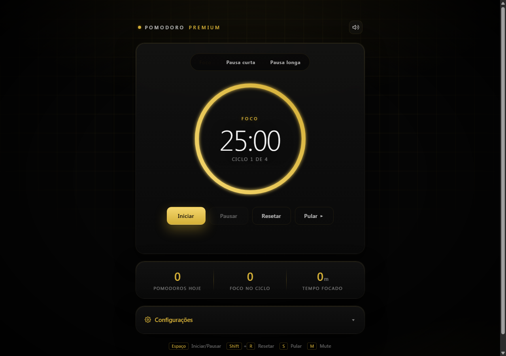
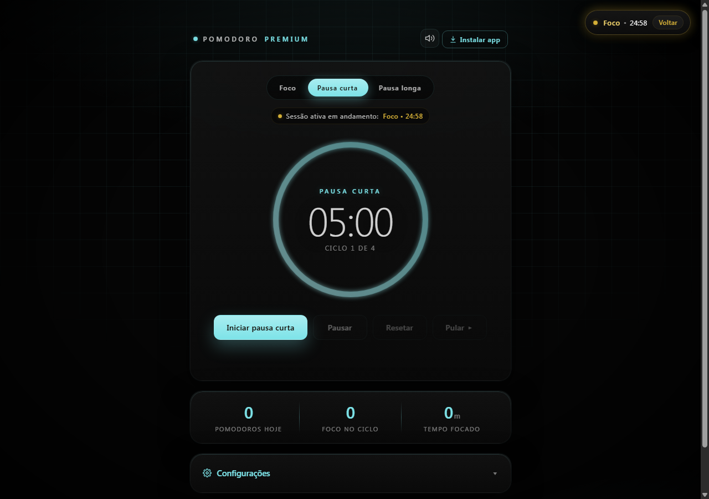
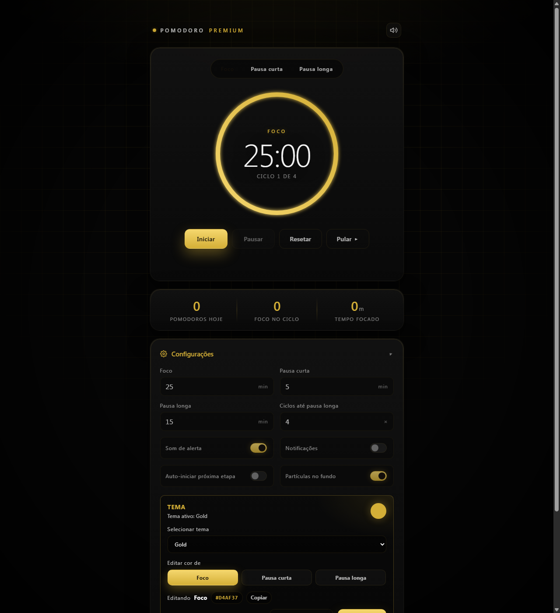
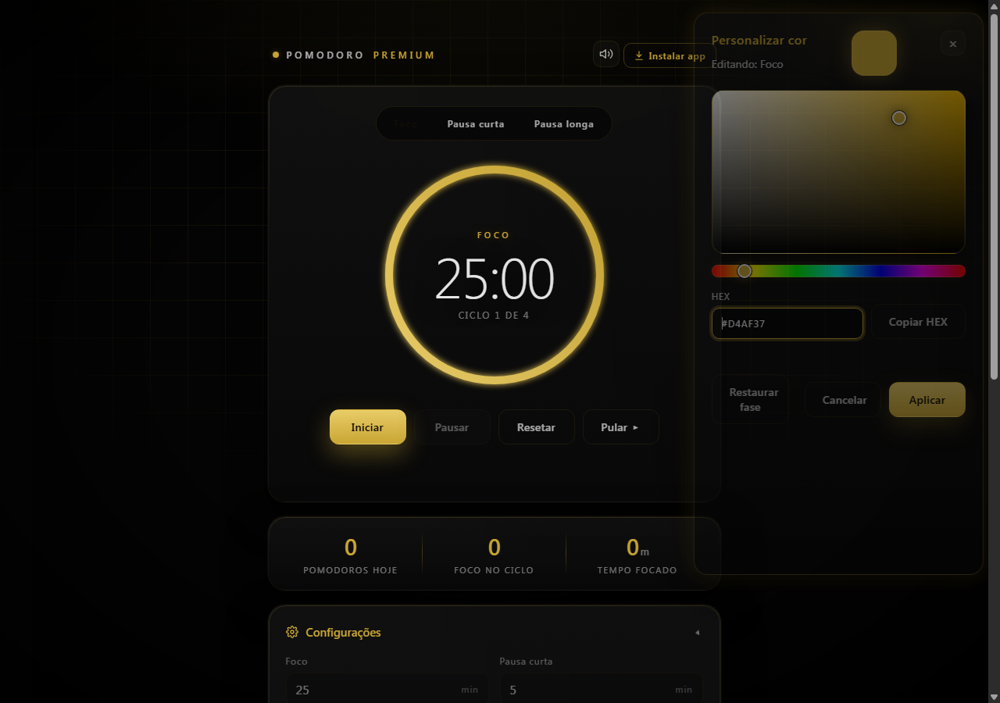
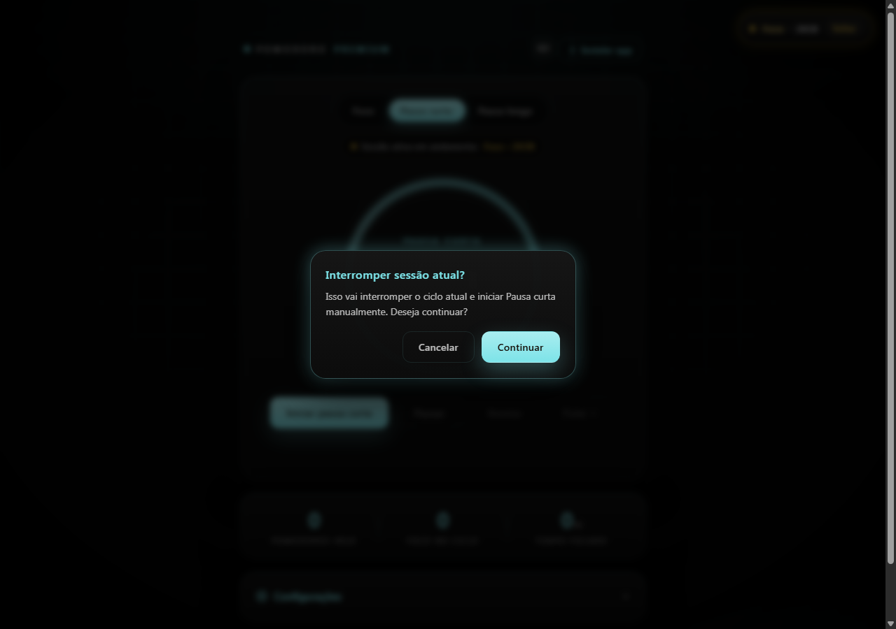

# Pomodoro Premium

Pomodoro Premium v1.0.1 e um timer Pomodoro preto premium para foco, pausas ergonomicas e acompanhamento do ciclo do dia. O mesmo frontend roda como PWA/web e como app desktop Windows via Tauri.

## Screenshots

| Tela principal | Mini timer |
|---|---|
|  |  |

| Configuracoes e temas | Color picker lateral |
|---|---|
|  |  |

| Modal de confirmacao |
|---|
|  |

## Recursos

- Timer com fases de foco, pausa curta e pausa longa.
- `selectedTab` separado de `activeMode`: a aba visual pode mostrar preview enquanto a sessao real continua intacta.
- Mini timer para a sessao ativa quando o usuario esta visualizando outra fase.
- Banner contextual da sessao ativa.
- Modal de confirmacao antes de interromper um ciclo ativo.
- Sistema de temas por fase em `pomo.theme.v2`.
- Temas prontos: Gold, Pink e Green.
- Personalizacao HEX individual para Foco, Pausa curta e Pausa longa.
- Color picker lateral com hue, saturacao/brilho, preview em tempo real, copiar HEX, restaurar fase, cancelar e aplicar.
- Persistencia em `localStorage` para configuracoes, estado do timer, historico e tema.
- PWA instalavel e funcional offline apos a primeira visita.
- App desktop Windows via Tauri, com instalador NSIS e MSI.
- Sem frameworks e sem dependencias externas no runtime do frontend.

## Tema por fase

O tema salvo usa a chave `pomo.theme.v2`:

```json
{
  "themeName": "custom",
  "phases": {
    "focus": { "primary": "#68DDBD" },
    "shortBreak": { "primary": "#8FF5D9" },
    "longBreak": { "primary": "#9E8CFF" }
  }
}
```

`src/js/theme.js` centraliza:

- presets de tema;
- validacao rigida de HEX (`#RGB` e `#RRGGBB`);
- normalizacao para `#RRGGBB`;
- conversoes RGB/HSV;
- geracao de hover, glow, accent e shadow;
- preview temporario;
- aplicar, cancelar e restaurar.

`src/js/timer.js` nao contem logica de tema.

## Preview vs sessao ativa

- `selectedTab` controla o que o card principal mostra.
- `activeMode` controla o timer real.
- Trocar a aba ou a fase editada no tema nao pausa, nao reinicia e nao altera a sessao ativa.
- Se `selectedTab` for diferente de `activeMode`, o card mostra preview e o mini timer mostra a sessao real.

## Usar como PWA/web

PWA precisa de HTTP/HTTPS. Nao use `file://`.

```powershell
python -m http.server 8080
```

Abra:

```text
http://localhost:8080
```

No Chrome ou Edge, use o botao "Instalar app" ou o icone de instalacao da barra de endereco.

## Instalar no Windows por GitHub Releases

Para usuario comum, baixe o instalador NSIS da pagina de Releases do GitHub:

```text
Pomodoro Premium_1.0.1_x64-setup.exe
```

Arquivo esperado para anexar na release:

```text
src-tauri/target/release/bundle/nsis/Pomodoro Premium_1.0.1_x64-setup.exe
```

O instalador NSIS usa instalacao por usuario e nao deve ser commitado no repositorio. Publique `.exe` e `.msi` apenas em GitHub Releases.

## Build desktop para desenvolvimento

Pre-requisitos:

- Rust via https://rustup.rs/
- Microsoft C++ Build Tools
- Tauri CLI 2:

```powershell
cargo install tauri-cli --version "^2.0" --locked
```

Rodar em desenvolvimento:

```powershell
cd src-tauri
cargo tauri dev
```

Gerar build Windows:

```powershell
cd src-tauri
cargo tauri build
```

Saidas esperadas:

```text
src-tauri/target/release/bundle/nsis/Pomodoro Premium_1.0.1_x64-setup.exe
src-tauri/target/release/bundle/msi/Pomodoro Premium_1.0.1_x64_pt-BR.msi
```

Para usuario comum, priorize o NSIS `.exe`.

## Estrutura

```text
pomodoro-premium/
  index.html
  manifest.json
  service-worker.js
  public/icons/
  src/css/
  src/js/
    app.js
    timer.js
    theme.js
    storage.js
    settings.js
    pwa.js
    audio.js
    notifications.js
  src-tauri/
    tauri.conf.json
    Cargo.toml
  docs/screenshots/
```

## Adicionar um tema

Adicione um preset em `PRESET_THEMES` dentro de `src/js/theme.js`:

```js
blue: Object.freeze({
  name: 'blue',
  label: 'Blue',
  phases: Object.freeze({
    focus: Object.freeze({ primary: '#4F9EFF' }),
    short: Object.freeze({ primary: '#74D6FF' }),
    long: Object.freeze({ primary: '#9A8CFF' }),
  }),
})
```

Depois adicione a opcao em `#themeSelect` no `index.html`. Se quiser fallback antes do JavaScript carregar, adicione os tokens iniciais em `src/css/themes.css`.

## Checklist de release

- Atualizar `src-tauri/Cargo.toml`.
- Atualizar `src-tauri/tauri.conf.json`.
- Atualizar `service-worker.js` quando houver mudanca no shell PWA.
- Gerar screenshots em `docs/screenshots/`.
- Rodar `cargo tauri build`.
- Conferir `git status`.
- Confirmar que `src-tauri/target/`, `.exe` e `.msi` nao entram no commit.
- Publicar o instalador NSIS em GitHub Releases.

## Licenca

MIT. Veja `LICENSE`.

## Aviso ergonomico

Pomodoro Premium oferece lembretes leves para pausas e descanso. Ele nao substitui orientacao medica. Em caso de dor, formigamento ou desconforto persistente, procure um profissional de saude.
